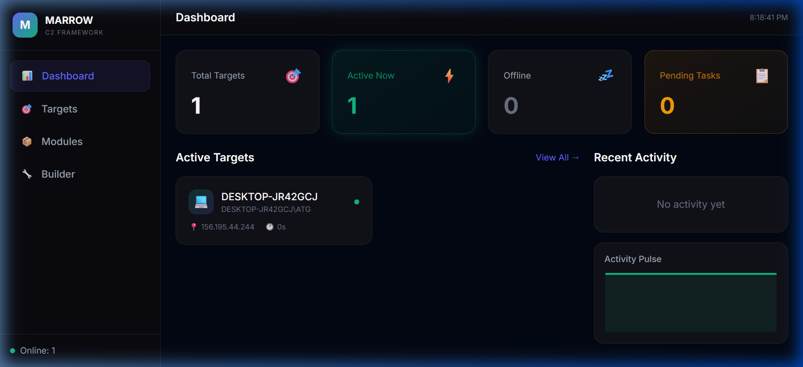

# 🦴 Marrow C2

**Custom Command & Control framework for red team operations.**

Marrow is a full-stack C2 platform with a PHP web dashboard and a PowerShell agent. It supports real-time target management, modular post-exploitation, live screen capture, and a task queue system — all deployed on AWS.

**Live Dashboard:** [c2.hussein.top](https://c2.hussein.top)

---

## Dashboard



## Target Control Panel


---

## Architecture

### Controller (Web Dashboard)
- **Stack:** PHP 8, MySQL, Tailwind CSS, vanilla JS
- **Auth:** Session-based authentication
- **Features:**
  - Real-time target list with heartbeat status (online/offline)
  - Task queue: send commands to targets and view results in an activity feed
  - Module system: Screen capture, process list, system info, shell, keylogger, persistence, privilege escalation
  - Builder page for generating new payloads

### Agent (`payload/agent.py`)
- **Compiled to:** `OneDriveUpdater.exe` via PyInstaller
- **Features:**
  - HWID-based target fingerprinting
  - HTTP(S) check-in with configurable intervals
  - Integrity level detection (admin vs user)
  - Modular command execution (Python, PowerShell, CMD)
  - Anti-analysis checks (detects Process Hacker, Wireshark, x64dbg, VM environments)

### Payload Binder (`binder/`)
- `bind.py` — Combines the agent with a legitimate executable so the payload masquerades as normal software (e.g., `OneDriveUpdater.exe`)
- The pre-compiled payload is available in `payload/dist/`

## Evasion

- The compiled payload **bypasses most modern antivirus engines**, including Windows Defender
- Uses living-off-the-land techniques and dynamic memory invocation
- AMSI patching and fileless execution where possible
- Communications blend with normal HTTPS traffic patterns

## Project Structure

```
├── api/            # Agent communication endpoints (gate.php, sync.php)
├── assets/         # Dashboard CSS and JS
├── binder/         # Payload binder utility
├── includes/       # PHP classes (Database, Target, Task, Auth)
├── modules/ui/     # Dashboard module interfaces (screen, shell, keylogger, etc.)
├── pages/          # Dashboard pages (targets, target detail, modules, builder)
├── payload/        # Agent source + compiled executable
│   ├── agent.py
│   └── dist/OneDriveUpdater.exe
├── schema.sql      # Database schema
├── index.php       # Dashboard entry point
└── login.php       # Authentication
```

> **Disclaimer:** Marrow is built for authorized red team engagements and educational purposes only.
